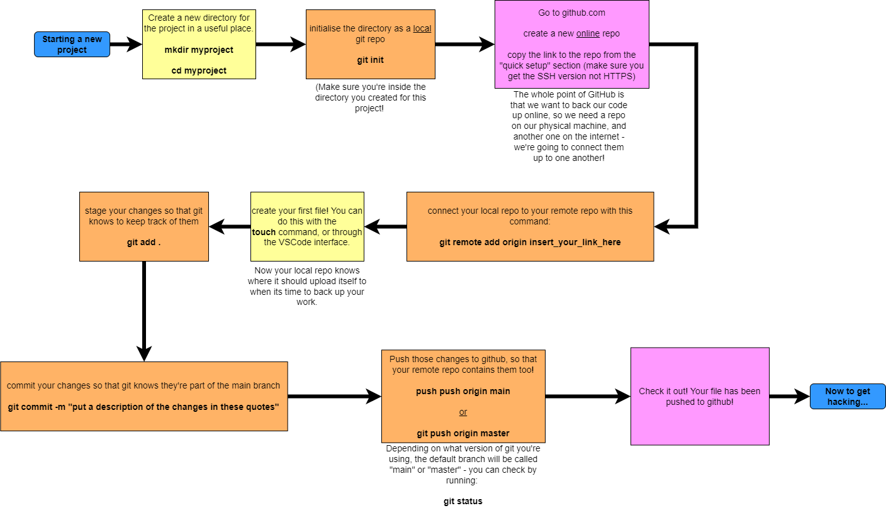
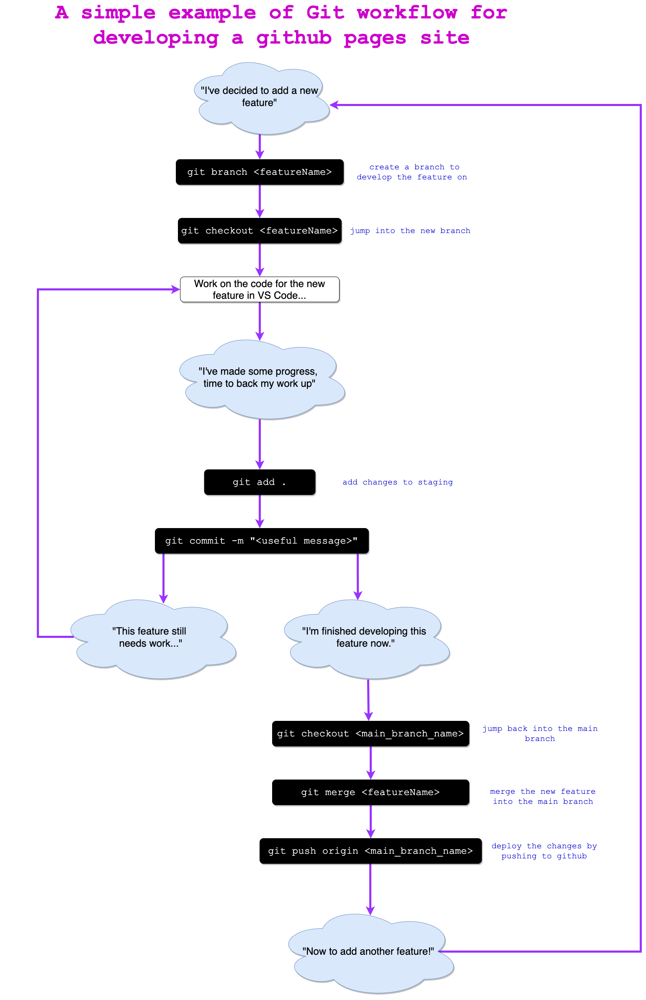

# Today's lesson:

The goal of today's walkthrough is to use git to track some changes to the styling of this webpage. 

## Step 0 - Get the tools!
To begin with, we are going to make sure everyone has git set up. Open your terminal and run the following command:

```bash
git --version
```

If you see something along the lines of 

> `git version 2.36.0`

then you should be good to go. If you get an error saying that git isn't installed, you'll need to install it, which you can do with by following the instructions found [here](https://git-scm.com/book/en/v2/Getting-Started-Installing-Git). (But for most people it should be installed by default.)

## Step 1 - Clone it down!
In order to get a copy of this repository on your computer, we need to use git to "clone" it. You can do that by running the following command:

```
git clone git@github.com:Oliver-CoderAcademy/ibisfacts.git
```

This downloads the repo onto your machine.

## Step 2 - Make it your own!
Because we cloned the files down from a repo I control, git knows that they are associated with that repository. That means that if you tried to back your changes up right now, git would try to upload the changed files back into my repository. 

This isn't allowed - I have my repo set up to only allow **me** to make those kinds of changes. To remove that association you can just run the command:

```
git remote remove origin
```

Later on you can add your own remote repo and associate it with this local copy, so that you can back your changes up to your own account.

## Step 3 - Let's talk code!
With that out of the way, we are ready to make some changes! I'll run through the code in class and you can follow along with me. We will be looking at using:
- the CSS `display` property
- the CSS `position` property
- the CSS box model

Each time we make a change, we will record our changes using git for version control as follows...

## Step 4 - Back it up!
Whenever we start adding a new feature, this is the process we should follow:
1. Make a new branch with ```git branch insert_some_branch_name_here```
1. Begin writing a little code
1. Add the first set of changes to staging with ```git add .```
1. Commit the changes to our branch with ```git commit -m "insert some message in these quotes"```
1. Repeat steps 2-4 until the feature is complete!
1. Once we are happy with our new feature we can merge it into the main branch with ```git checkout main && git merge insert_branch_name_here```

## Final Step - Send it to the cloud!

To back up the work you did today online, you need a [github.com](github.com) account. If you haven't done that yet, you'll have to work through the steps in [this edstem lesson](https://edstem.org/au/courses/8571/lessons/21764/slides/154034).

It's also a good idea here to make sure that your global git settings are correct. You can make sure that git knows the username and email address associated with your github account by running:

```
git config --global user.name "John Doe"
```

```
git config --global user.email johndoe@example.com
```

(replacing the name and email with your github username and email address)

Once that is complete, you'll need to create a new repository on Github, copy it's url, and use the `push` command to upload your code. I'll run through an example of this in class.

As a very final note, I recommend changing your default branch name to "main". By default Git will create a branch called master when you create a new repository with git init. It has been pointed out in recent years that this derives from "master"/"slave" terminology, and the new preferred default is `"main"`. It's easy to change, and will be applied to all future repositories you create on this machine. Just run:

```
git config --global init.defaultBranch main
```

# You might also find these flowcharts helpful:

## Creating a git project from scratch:


## Working on an existing git project:
